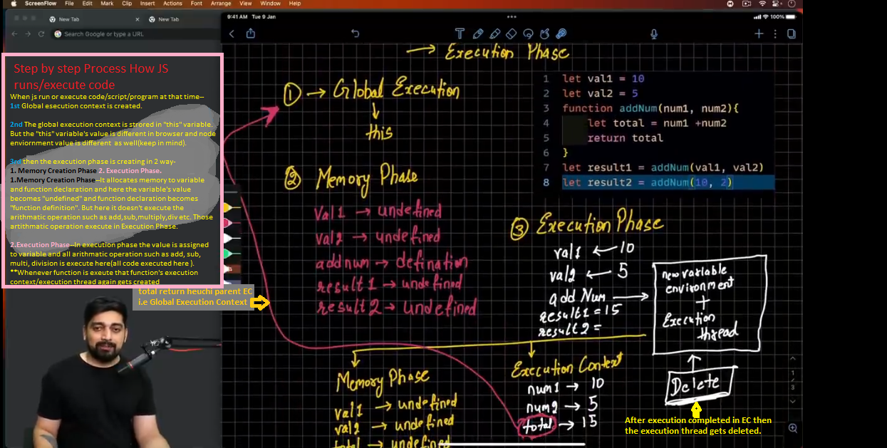

```TEXT
🚩Execution Context👌
```
```text
🎯Most Important Topic:👉 Execution Context work flow diagram explaination follow the Note book,                           and video of "Chai aur Code" JS video(TimeStamp--5:56:50 CC vdo2 ).

//🎁Execution Context:
//👉Execution context means whatever Code/Program/Script we have made to that Code/Program/Script, how js run and how js execute that code i.e. called Execution Context.

//SAME(👆Both👇)

//👉Execution context means whatever Code File/Program File/Script File we have made to that Code File/Program File/Script File, how js run and how js execute that code File i.e. called Execution Context.

//👉JS runs that code file in 2 phase-
// (1) Memory Creation Phase -- It allocates memory only to variable declaration and function declaration, but here variable's value become undefined. 
// (2) Execution Phase -- In Execution phase the actual value is assigned to variable.
//It performs all arithmatic operation (like +, -, /, *, % etc..)

//👉When js code runs, actually it runs inside an excution context.There are 3 types of code created in a new execution context.
// (1) Global Execution Context              (Global execution context created, when variable is defined globally like outside function / if any code that exist outside of the JS function)
// (2) Function/Functional Execution Context (Each function runs within its own execution context)
// (3) Eval Execution Context                (Optional--used in mongo db --it creates a new execution context)

//👉After created global execution context the it gets store in "this" variable.
//👉Keep in mind-- Browser -- Global execution context is different (it contains window object)
// node enviornment -- Global execution context is different

*****************Properly Not Correct***********************
//👇Execution Context Flow/Process after run code file👇
//1️⃣Global Execution Context created inside CallStack/Execution Stack
//2️⃣Memory Creation Phase created inside CallStack/Execution Stack
//3️⃣Execution Phase created inside CallStack/Execution Stack
//4️⃣After execution completed then that execution context gets deleted.
**************************************

//👇BEST👌✅
//🎯🎯How JavaScript Execute code/program/script Step by Step Process?🎯🎯
//👉When js run or execute code/script/program at that time--
//1️⃣ 1st Global esecution context is created.
//2️⃣ 2nd The global execution context is strored in "this" variable. But remember 1 thing the "this" variable's value is different in browser and node enviornment "this" value is different  as well(keep in mind).
//3️⃣ 3rd then the execution phase is creating in 2 way- 1. Memory Creation Phase 2. Execution Phase.
// 1.Memory Creation Phase--It allocates memory to variable and function declaration and here the variable's value becomes "undefined" and function declaration becomes "function definition". 
//   But here it doesn't execute the arithmatic operation or any code such as add,sub,multiply,div etc. Those artithmatic operation execute in Execution Phase.
// 2.Execution Phase--In execution phase the value is assigned to variable and all arithmatic operation such as add, sub, multi, division is execute here(all code executed here ).
//   Whenever function is exeute that function's execution context/execution thread again gets created. After execution completed then that execution thread gets deleted.


//🔔Note: If you want more better understanding regarding "Execution Context" then check out Thapa Technical Event Loop vdo,
//         image in thapa technical js folder.
```



